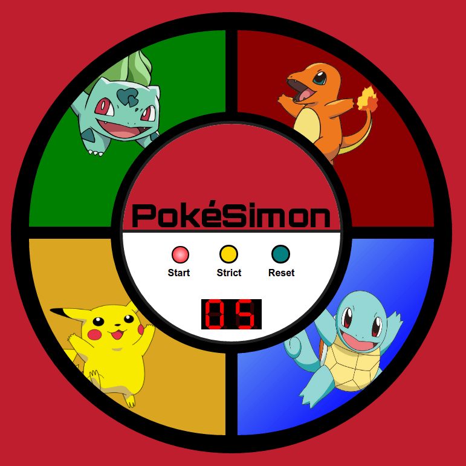

# PokéSimon

## Description

PokéSimon takes the typical [Simon](https://en.wikipedia.org/wiki/Simon_%28gam%289) game, but adds a [Pokémon](https://en.wikipedia.org/wiki/Pok%C3%A9mon) theme to it. It is a game used to test memory skill by remembering patterns that increase in length as the game progresses.

## Live Demo

https://coymeetsworld.github.io/poke-simon/

	

## Instructions

When a player starts a game, PokéSimon will light up one of the buttons at random. The player must click that button correctly in order to advance.

On a successful press, the game will continue by lighting up the same button and an additional randomized button afterwards. The player must now click both buttons in the correct order to move on to the next level.

As the player sucessfully clicks the correct order of randomized buttons, one additional randomized button gets added to the pattern in each level. The game finishes when a player can correctly hit a pattern of 20 randomized buttons. 

### Modes

The player can turn on 'Strict mode', which means if a player guesses incorrectly at any point in the pattern the player will have to start over on level 1 with a new randomized pattern.

With 'Strict mode' off, PokéSimon will replay the pattern at the current level and the player will try again. PokéSimon by default has the 'Strict' feature off.

## About

PokéSimon was written by Coy Sanders as a requirement in the [Advanced Front-End Development Projects](https://www.freecodecamp.com/challenges/build-a-pomodoro-clock) for [FreeCodeCamp](http://www.freecodecamp.com) to earn the Front-End Development Certification.

software is licensed under the 

Copyright (c) 2017 

## Other Credits

Pokémon is trademark of [Nintendo](http://www.pokemon.com/us/legal/) and created by Satoshi Tajiri in 1995.

Multiple Pokémon sounds from [here](http://www.sounds-resource.com/nintendo_64/pkmnsnap/sound/1659/).

Psyduck sound on failure grabbed [here](https://drive.google.com/file/d/0B5J1GAprDj4PVkQ2T0pULWtvVUE/view).

Victory sound on completing 20 moves correctly, found [here](http://downloads.khinsider.com/game-soundtracks/album/pokemon-original-game-soundtrack/116-victory-vs-trainer-.mp3).

Pokeball images grabbed from [this wallpaper](http://wallpaperswide.com/pokemon_pokeball_red-wallpapers.html).

Seven-segment display used is a jQuery UI plugin developed by Brandon White and the code/documentation can be found on his [GitHub website](http://brandonlwhite.github.io/sevenSeg.js/).